# bbolt API Operations Flow

This document provides detailed flow diagrams for key bbolt operations, showing how requests flow through the system and how different components interact.

## Database Lifecycle Operations

### Database Open Operation

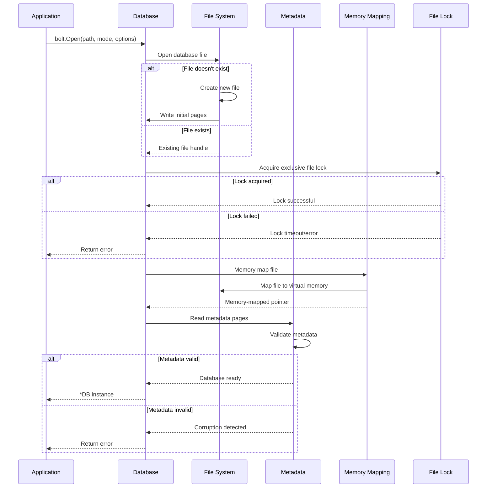

### Database Close Operation

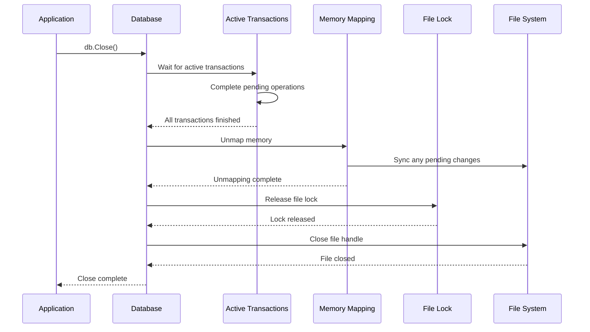

## Transaction Operations

### Read Transaction Flow

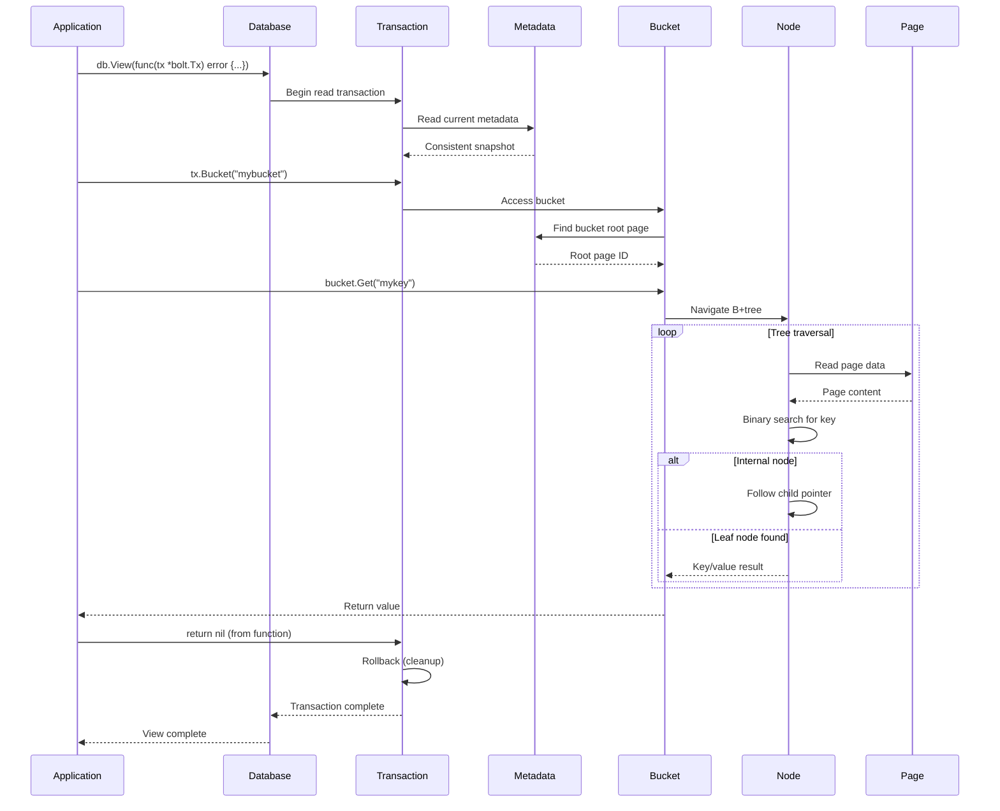

### Write Transaction Flow

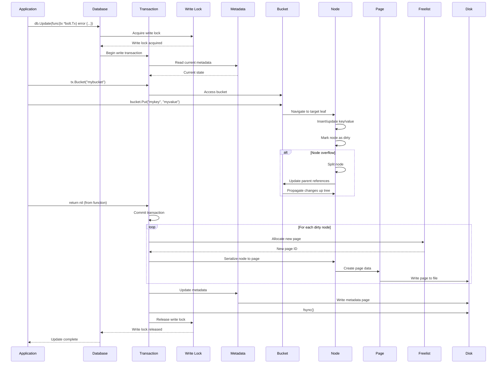

## Bucket Operations

### Bucket Creation

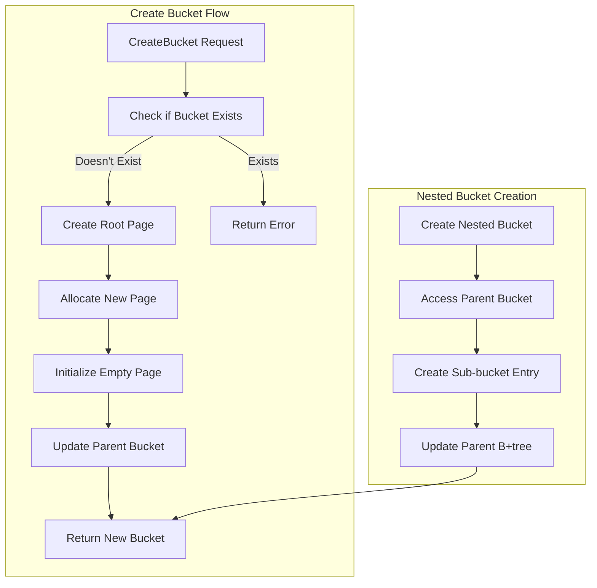

### Bucket Deletion

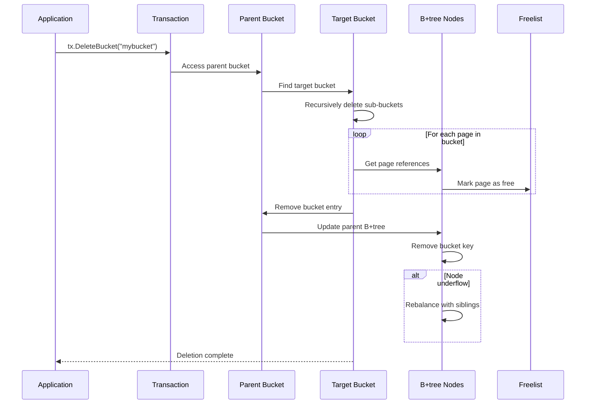

## Key/Value Operations

### Put Operation Detailed Flow

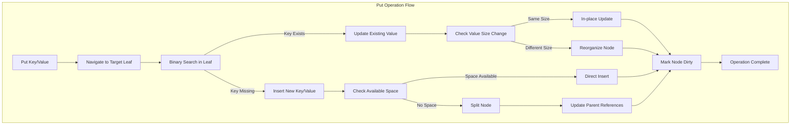

### Get Operation Detailed Flow

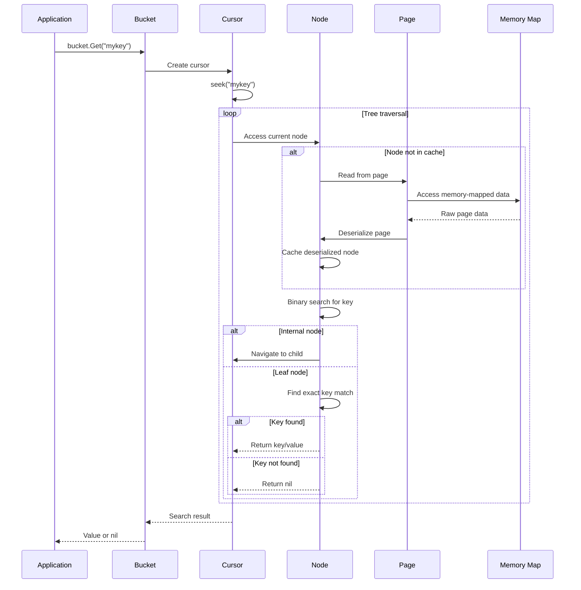

### Delete Operation Flow

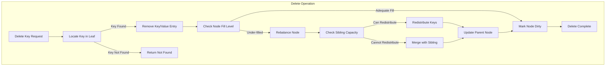

## Cursor Operations

### Cursor Iteration Flow

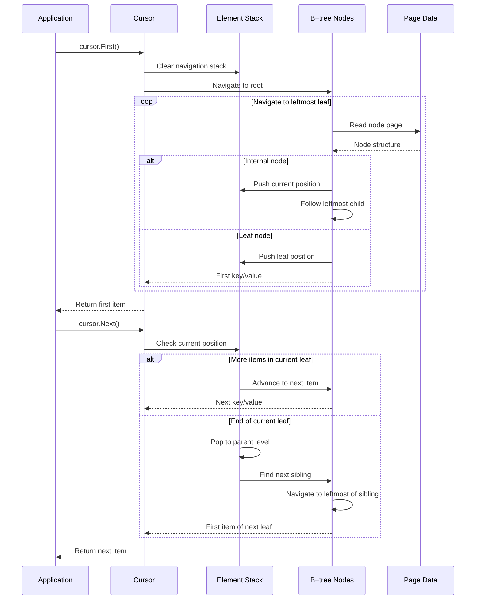

### Cursor Seek Operation

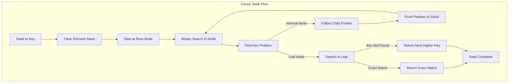

## Batch Operations

### Batch Write Operation

```mermaid
sequenceDiagram
    participant App as Application
    participant DB as Database
    participant BatchMgr as Batch Manager
    participant Tx as Transaction
    participant Timer as Timer
    
    App->>DB: db.Batch(func(tx *bolt.Tx) error {...})
    DB->>BatchMgr: Add to batch queue
    
    par Batch accumulation
        DB->>Timer: Start batch timer
        and
        loop More batch requests
            App->>DB: db.Batch(...)
            DB->>BatchMgr: Add to batch queue
        end
    end
    
    alt Timer expires OR batch full
        Timer->>BatchMgr: Trigger batch execution
        and
        BatchMgr->>Tx: Begin write transaction
        
        loop For each batched operation
            BatchMgr->>Tx: Execute operation
            Tx->>Tx: Apply changes
        end
        
        Tx->>Tx: Commit all changes
        Tx-->>BatchMgr: Batch complete
        BatchMgr-->>App: All operations complete
    end
```

## Error Handling Flows

### Transaction Error Recovery

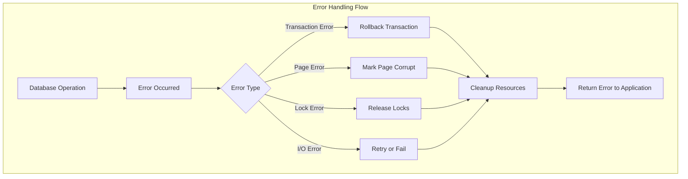

### Consistency Check Flow

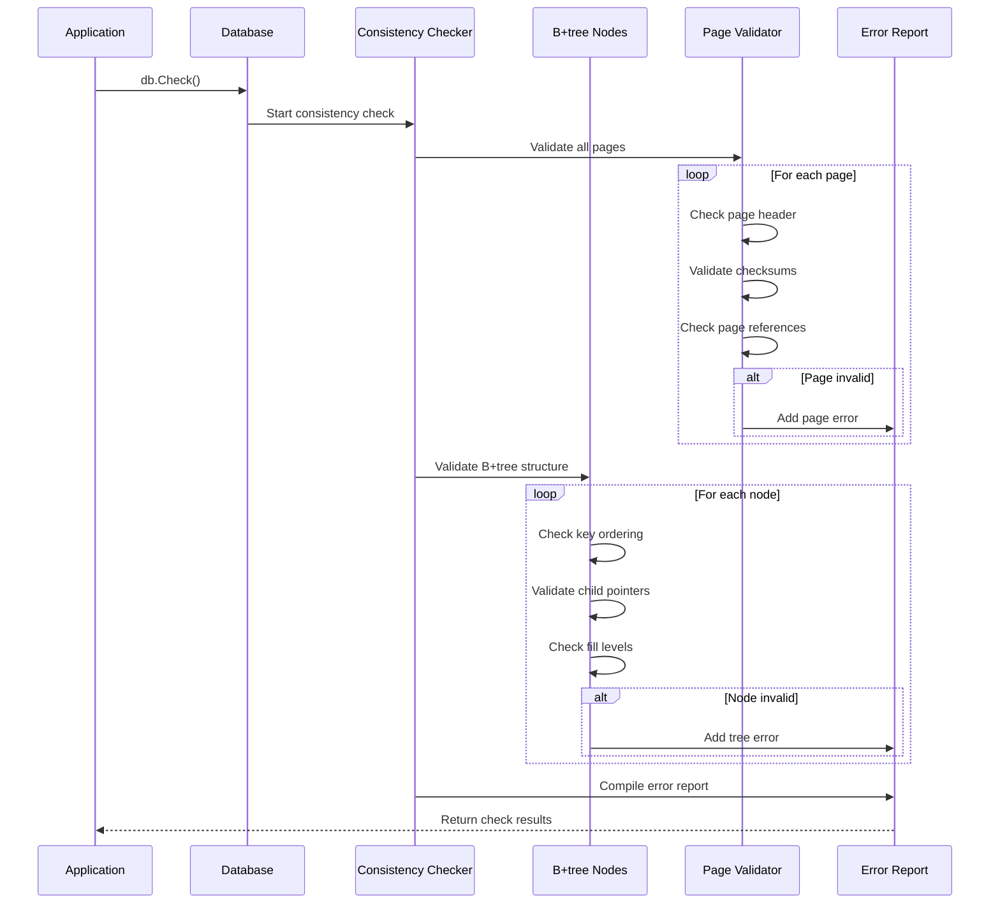

This comprehensive flow documentation shows how bbolt operations cascade through the system, providing insight into the interaction patterns between components and the data flow for both normal operations and error conditions.