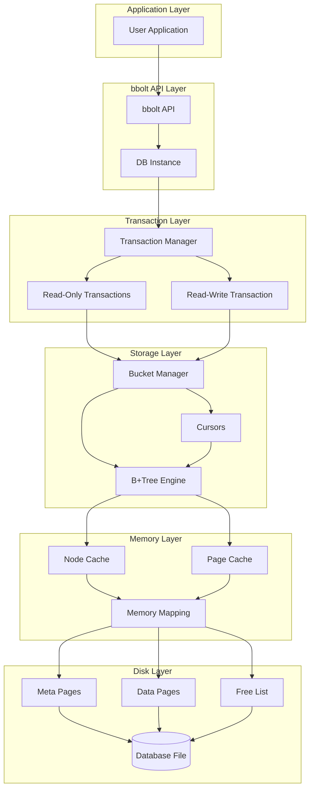
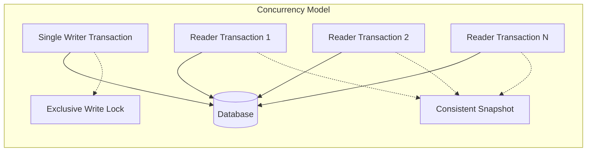
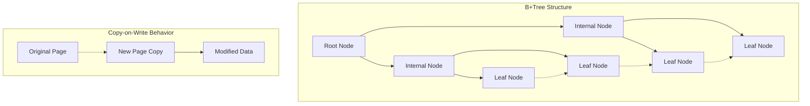
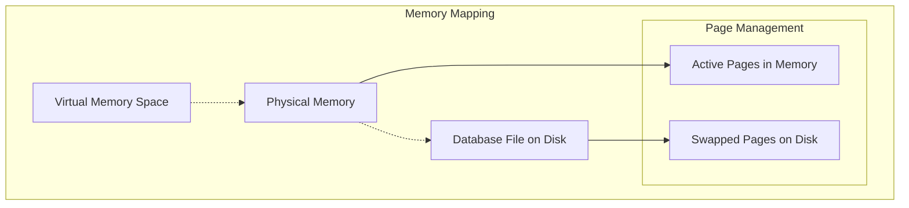
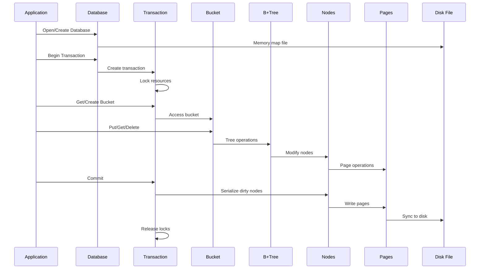

# bbolt System Architecture

bbolt is a pure Go embedded key/value database that provides ACID transactions with a B+tree storage engine. This document provides a high-level overview of the system architecture and how the major components interact.

## High-Level Architecture

## Core Components Overview

bbolt's architecture is organized into several key layers:

### 1. Application Interface Layer
- **Purpose**: Provides the public API for database operations
- **Key Components**: `DB` struct, public methods
- **Responsibilities**: Database lifecycle, connection management, API surface

### 2. Transaction Management Layer
- **Purpose**: Handles ACID transactions and concurrency control
- **Key Components**: `Tx` struct, transaction manager
- **Responsibilities**: MVCC, isolation, consistency, transaction lifecycle

### 3. Storage Management Layer
- **Purpose**: Manages data organization and access patterns
- **Key Components**: `Bucket`, `Cursor`, B+tree operations
- **Responsibilities**: Data organization, indexing, traversal

### 4. Memory Management Layer
- **Purpose**: Optimizes memory usage and provides caching
- **Key Components**: `node`, page cache, memory mapping
- **Responsibilities**: Memory-mapped I/O, in-memory node management, caching

### 5. Disk Storage Layer
- **Purpose**: Persistent storage and file management
- **Key Components**: Database file, pages, freelist
- **Responsibilities**: Durability, space management, file I/O

## Key Architectural Principles

### 1. Single Writer, Multiple Readers (MVCC)

### 2. Copy-on-Write B+Tree

### 3. Memory-Mapped File I/O

## Data Flow Overview

The following diagram shows how data flows through the system during a typical operation:

## Performance Characteristics

### Read Performance
- **Memory-mapped I/O**: Direct memory access to disk pages
- **B+tree structure**: O(log n) key lookups
- **Page-level caching**: OS manages page cache automatically
- **Multiple concurrent readers**: No blocking between read transactions

### Write Performance
- **Single writer**: No write-write conflicts to resolve
- **Copy-on-write**: Minimal page copying during modifications
- **Batch commits**: Efficient bulk operations via `DB.Batch()`
- **Freelist management**: Efficient space reuse

### Storage Efficiency
- **B+tree packing**: Configurable fill percentage for pages
- **Page reuse**: Freelist tracks and reuses deleted pages
- **Minimal overhead**: Simple file format with low metadata overhead
- **Compression friendly**: Sequential key storage benefits from compression

## Deployment Considerations

### File System Requirements
- **POSIX compliance**: Requires proper fsync() support
- **Memory mapping**: Benefits from efficient mmap() implementation
- **File locking**: Uses flock() for exclusive access

### Operating System Support
- **Cross-platform**: Works on Linux, macOS, Windows
- **Architecture support**: 32-bit and 64-bit systems
- **Endianness**: Database files are architecture-specific

### Resource Usage
- **Memory**: Uses memory mapping, size scales with active data
- **CPU**: Efficient B+tree operations, minimal overhead
- **Disk I/O**: Sequential writes, memory-mapped reads
- **File handles**: Single file handle per database

This architecture provides a robust foundation for an embedded database that balances simplicity, performance, and reliability.