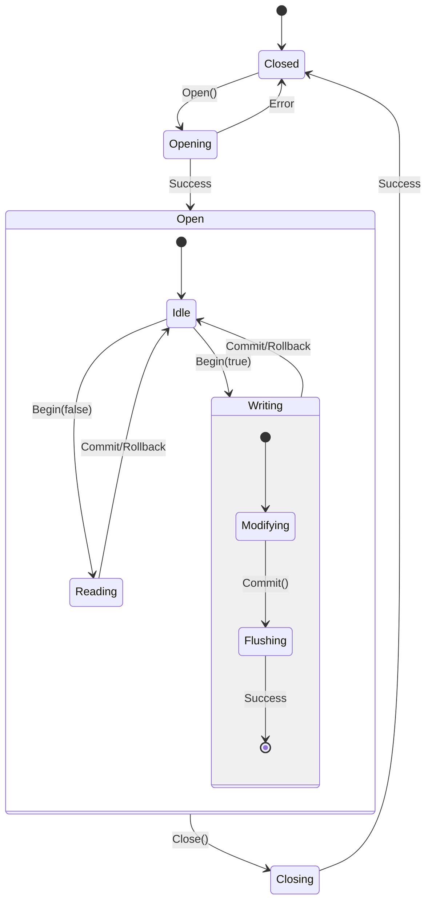
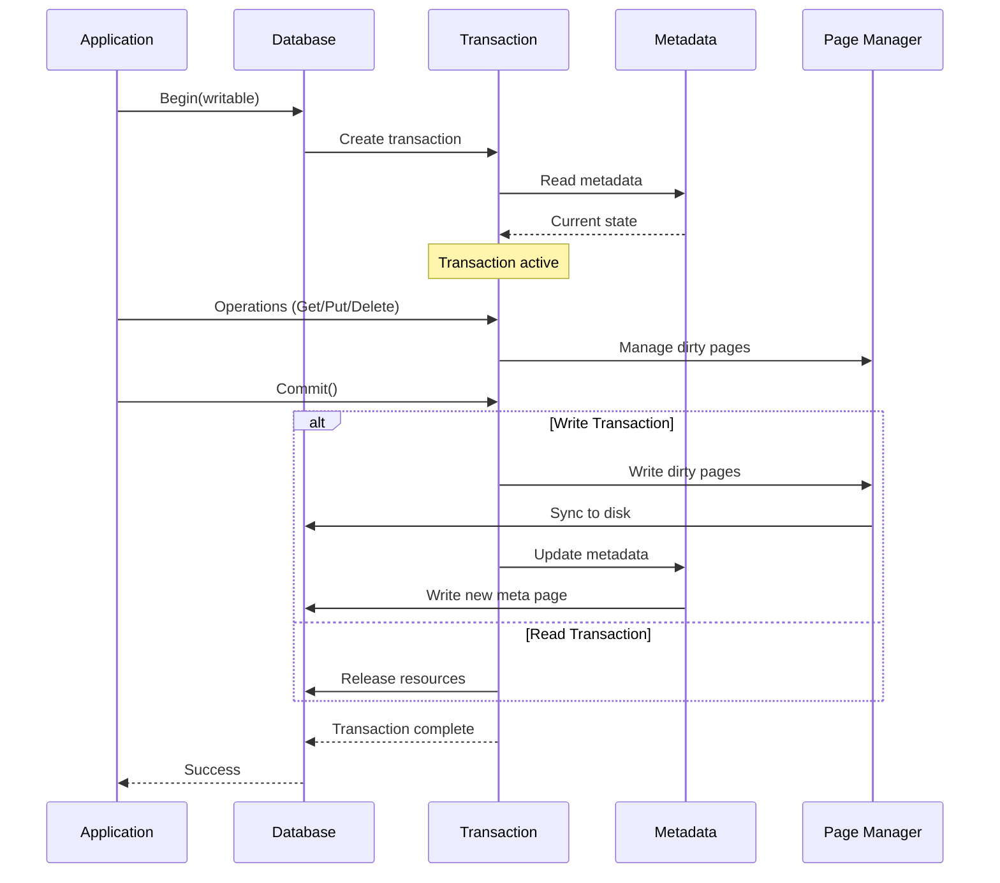
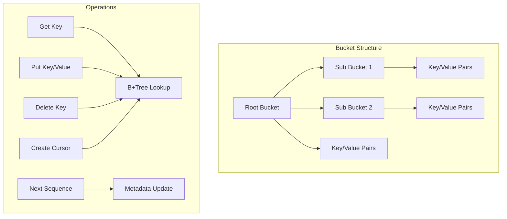
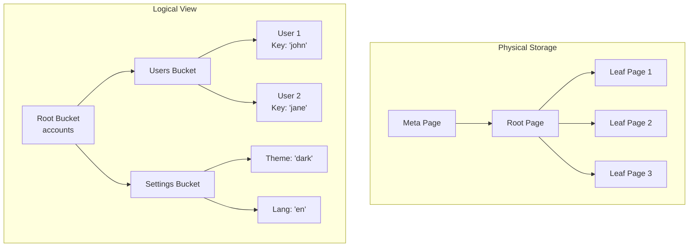
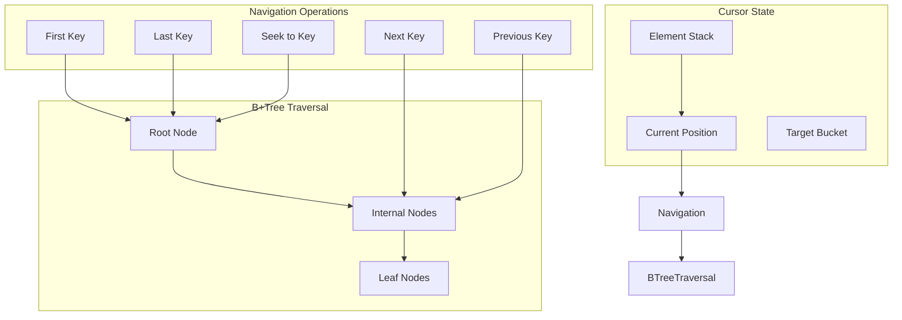
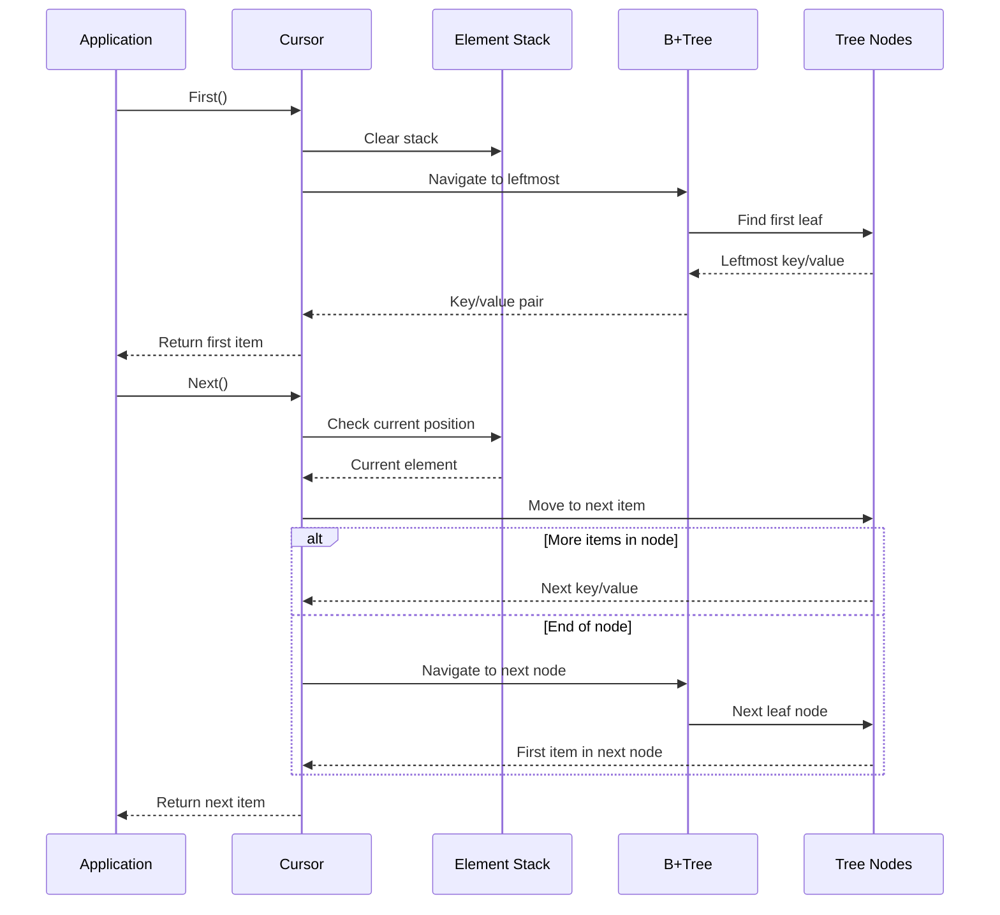
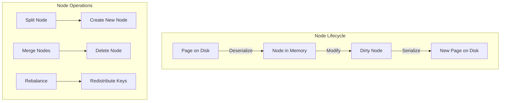
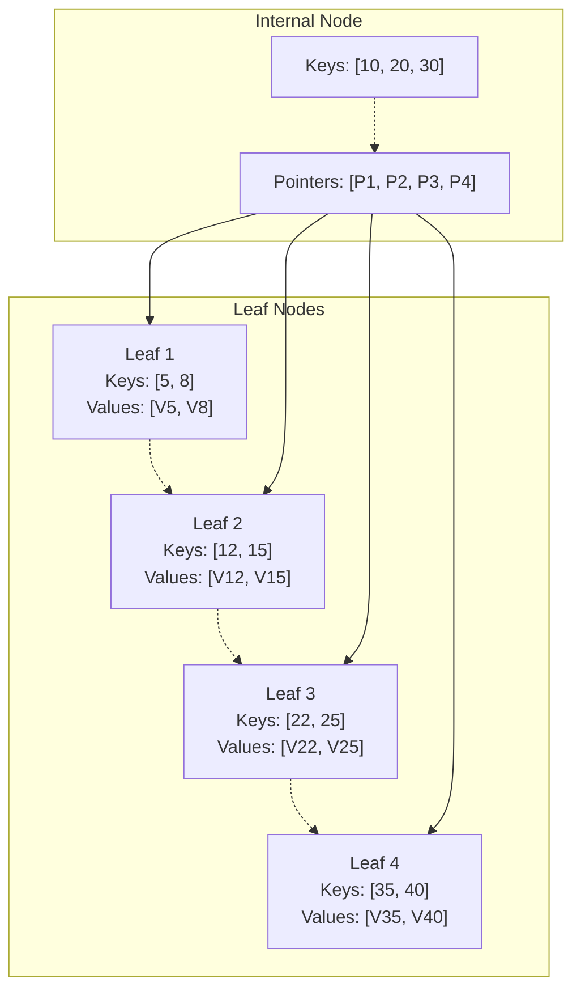
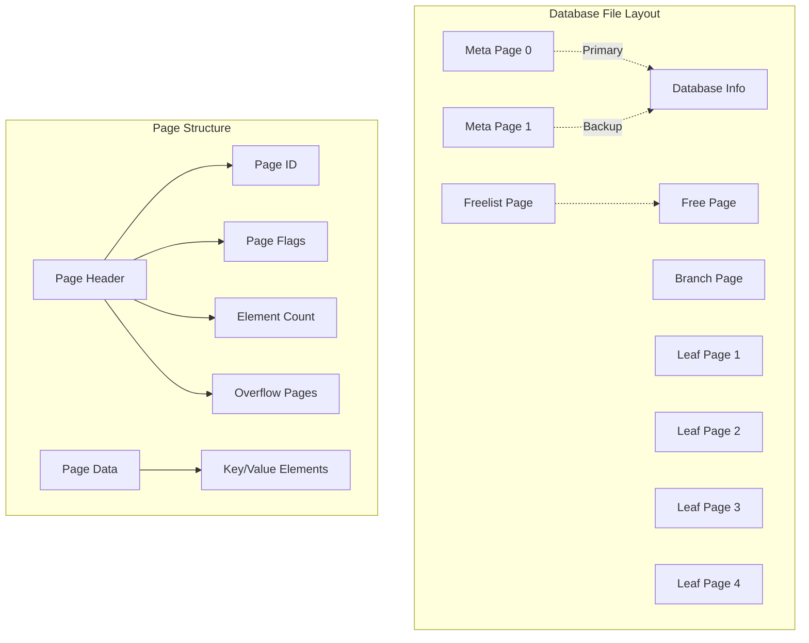
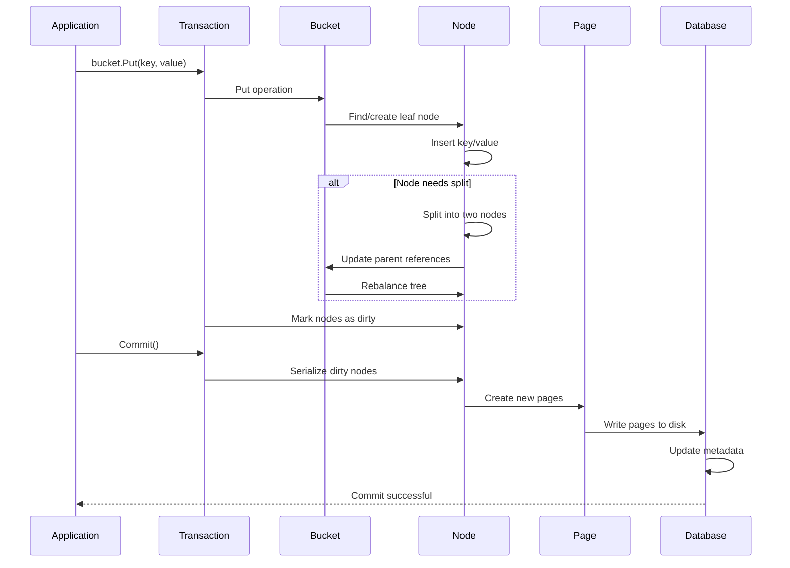

# bbolt Core Components

This document provides detailed information about bbolt's core components and their relationships.

## Component Overview

```mermaid
classDiagram
    class DB {
        +StrictMode bool
        +NoSync bool
        +ReadOnly bool
        +MmapFlags int
        +path string
        +file *os.File
        +dataref []byte
        +meta0 *meta
        +meta1 *meta
        +pageSize int
        +freelist *freelist
        +stats Stats
        +Open(path, mode, options) error
        +Close() error
        +Begin(writable) *Tx
        +View(func(*Tx)) error
        +Update(func(*Tx)) error
        +Batch(func(*Tx)) error
    }

    class Tx {
        +writable bool
        +managed bool
        +db *DB
        +meta *meta
        +root Bucket
        +pages map[pgid]*page
        +stats TxStats
        +Bucket(name) *Bucket
        +CreateBucket(name) *Bucket
        +DeleteBucket(name) error
        +Commit() error
        +Rollback() error
    }

    class Bucket {
        +tx *Tx
        +buckets map[string]*Bucket
        +page *page
        +rootNode *node
        +nodes map[pgid]*node
        +FillPercent float64
        +Get(key) []byte
        +Put(key, value) error
        +Delete(key) error
        +Cursor() *Cursor
        +CreateBucket(key) *Bucket
        +DeleteBucket(key) error
        +NextSequence() uint64
    }

    class Cursor {
        +bucket *Bucket
        +stack []elemRef
        +First() (key, value)
        +Last() (key, value)
        +Next() (key, value)
        +Prev() (key, value)
        +Seek(seek) (key, value)
    }

    class Node {
        +bucket *Bucket
        +isLeaf bool
        +unbalanced bool
        +spilled bool
        +key []byte
        +pgid pgid
        +parent *node
        +children nodes
        +inodes inodes
    }

    class Page {
        +id pgid
        +flags uint16
        +count uint16
        +overflow uint32
        +ptr uintptr
    }

    DB ||--o{ Tx : manages
    Tx ||--o{ Bucket : contains
    Bucket ||--o{ Cursor : creates
    Bucket ||--o{ Node : manages
    Node ||--o{ Page : represents
    Bucket ||--|| Node : root
```

## 1. Database (DB)

The `DB` struct represents the entire database and is the main entry point for all operations.

### Key Responsibilities
- File management and memory mapping
- Transaction coordination
- Metadata management
- Resource cleanup

### Important Fields
```go
type DB struct {
    // Configuration flags
    StrictMode bool     // Enable consistency checks
    NoSync     bool     // Skip fsync for performance
    ReadOnly   bool     // Read-only mode
    
    // File system interface
    path     string     // Database file path
    file     *os.File   // Open file handle
    dataref  []byte     // Memory-mapped data
    
    // Database metadata
    meta0    *meta      // Primary metadata page
    meta1    *meta      // Secondary metadata page
    pageSize int        // Database page size
    
    // Resource management
    freelist *freelist  // Free page management
    stats    Stats      // Performance statistics
}
```

### Lifecycle Operations


## 2. Transaction (Tx)

Transactions provide ACID guarantees and manage the scope of database operations.

### Transaction Types
- **Read-only transactions**: Multiple concurrent readers
- **Read-write transactions**: Single writer, exclusive access

### Key Responsibilities
- Isolation and consistency
- Page management during transaction lifetime
- Bucket management
- Commit/rollback operations

### Transaction Lifecycle


## 3. Bucket

Buckets are collections of key/value pairs, similar to tables in relational databases.

### Key Features
- Nested buckets (buckets within buckets)
- B+tree storage for efficient access
- Configurable fill percentage
- Auto-incrementing sequences

### Bucket Operations


### Bucket Tree Structure


## 4. Cursor

Cursors provide efficient iteration over key/value pairs in lexicographical order.

### Cursor Operations
- Sequential traversal (First, Last, Next, Prev)
- Seeking to specific keys
- Range scans and prefix searches

### Cursor Implementation


### Cursor Traversal Example


## 5. Node

Nodes represent in-memory, deserialized pages from the B+tree structure.

### Node Types
- **Leaf nodes**: Contain actual key/value pairs
- **Internal nodes**: Contain keys and pointers to child nodes

### Node Management


### B+Tree Node Structure


## 6. Page

Pages represent the physical storage units on disk, typically 4KB in size.

### Page Types
- **Meta pages**: Database metadata (2 copies for redundancy)
- **Freelist pages**: Track available pages
- **Branch pages**: Internal B+tree nodes
- **Leaf pages**: B+tree leaf nodes

### Page Layout


## Component Interactions

The following diagram shows how components interact during a typical Put operation:



This component architecture provides a clean separation of concerns while maintaining high performance through efficient data structures and minimal copying operations.