# bbolt Memory Management

bbolt uses memory-mapped I/O and sophisticated caching strategies to provide efficient access to database pages while minimizing memory usage. This document details the memory management architecture, page caching, and optimization strategies.

## Memory Architecture Overview

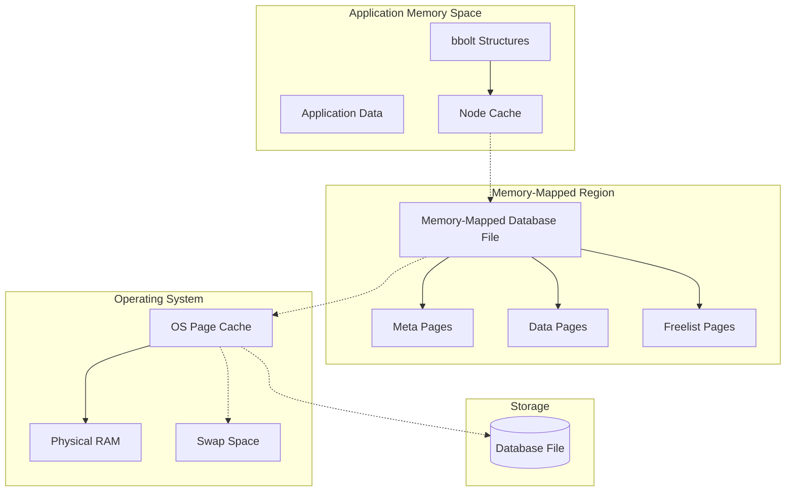

## Memory-Mapped I/O

bbolt uses memory mapping to provide direct access to database pages without explicit I/O operations.

### Memory Mapping Process

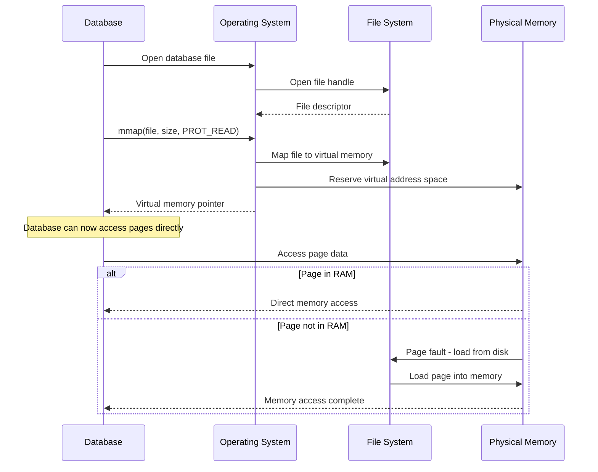

### Memory Mapping Benefits

```mermaid
graph TD
    subgraph "Memory Mapping Advantages"
        DirectAccess[Direct Memory Access]
        OSManaged[OS-Managed Caching]
        ZeroCopy[Zero-Copy Operations]
        LazyLoading[Lazy Page Loading]
        SharedMemory[Shared Memory Across Processes]
        
        DirectAccess --> FastReads[Fast Read Performance]
        OSManaged --> EfficientCache[Efficient Cache Management]
        ZeroCopy --> LowOverhead[Low CPU Overhead]
        LazyLoading --> MemoryEfficiency[Memory Efficiency]
        SharedMemory --> ProcessSharing[Inter-Process Sharing]
    end
    
    subgraph "Implementation Details"
        MMAP[mmap() System Call]
        VirtualMemory[Virtual Memory Management]
        PageFaults[Page Fault Handling]
        
        MMAP --> VirtualMemory
        VirtualMemory --> PageFaults
        PageFaults --> LazyLoading
    end
```

## Node Caching Strategy

bbolt maintains an in-memory cache of deserialized B+tree nodes to avoid repeated parsing of page data.

### Node Cache Architecture

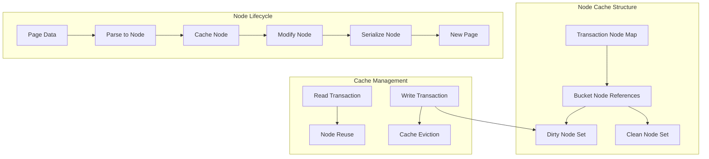

### Node Cache Implementation

```mermaid
classDiagram
    class Transaction {
        +pages map[pgid]*page
        +nodes map[pgid]*node
        +root Bucket
        +getNode(pgid) *node
        +deleteNode(pgid)
    }
    
    class Bucket {
        +nodes map[pgid]*node
        +rootNode *node
        +node(pgid, parent) *node
        +rebalance()
    }
    
    class Node {
        +bucket *Bucket
        +isLeaf bool
        +unbalanced bool
        +spilled bool
        +key []byte
        +pgid pgid
        +parent *node
        +children nodes
        +inodes inodes
        +read(page)
        +write(page)
        +spill() error
    }
    
    Transaction ||--o{ Bucket : manages
    Bucket ||--o{ Node : caches
    Node ||--|| Node : parent/child
```

## Page Management

bbolt manages database pages through a combination of memory mapping and active page tracking.

### Page Access Pattern

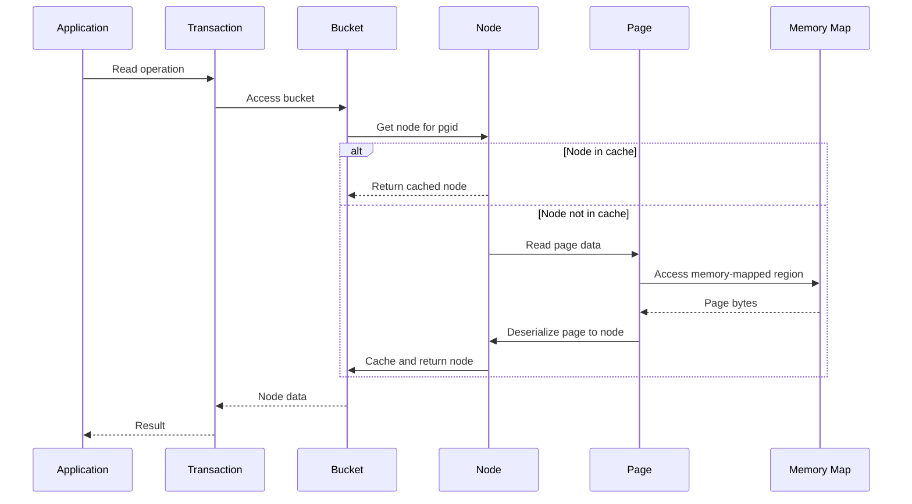

### Page Cache Integration

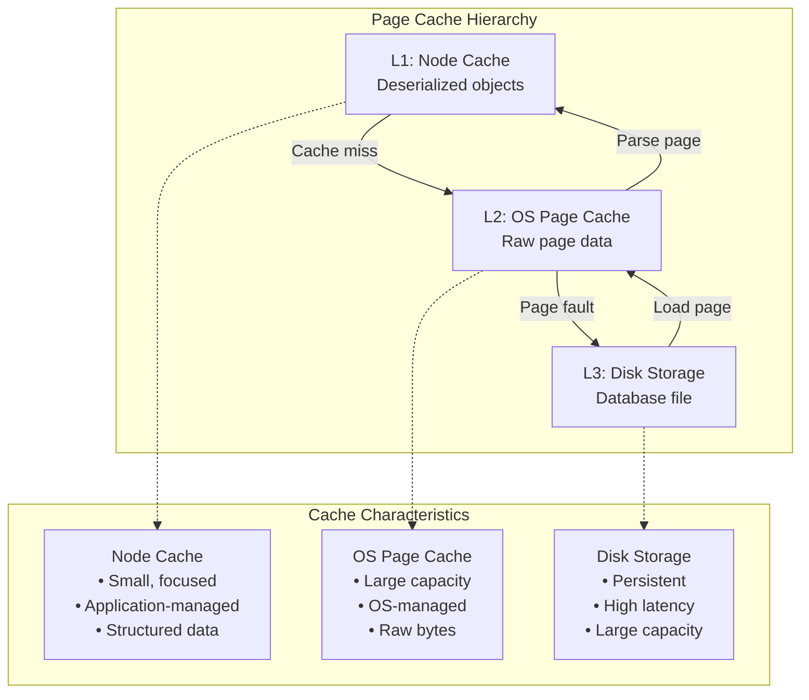

## Memory Usage Patterns

### Read Operations Memory Usage

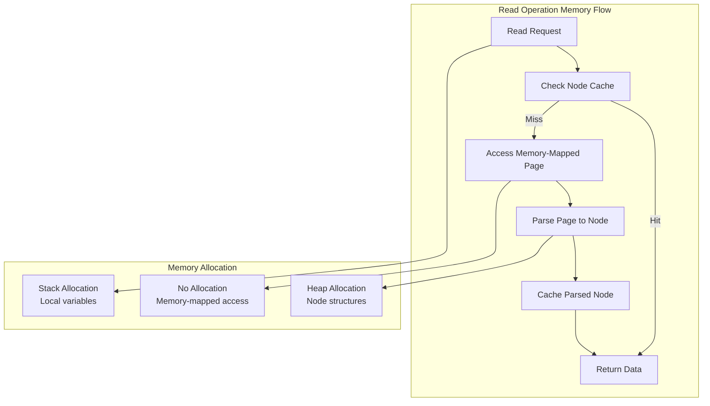

### Write Operations Memory Usage

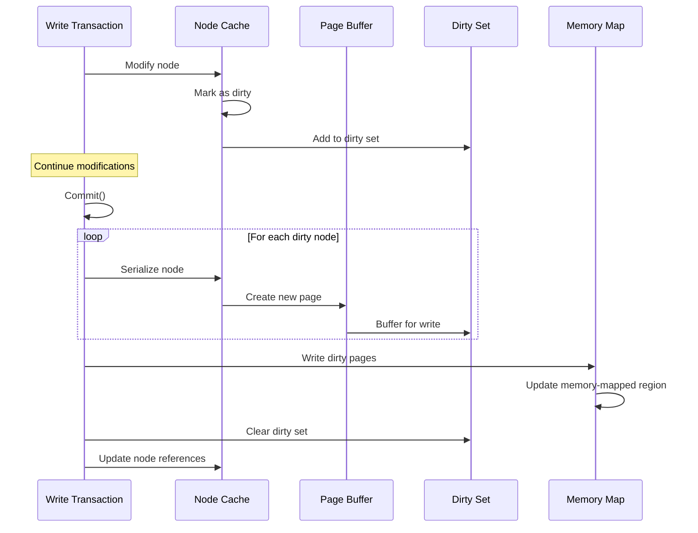

## Memory Optimization Strategies

### Large Database Handling

bbolt can handle databases larger than available RAM through memory mapping and OS page cache management:

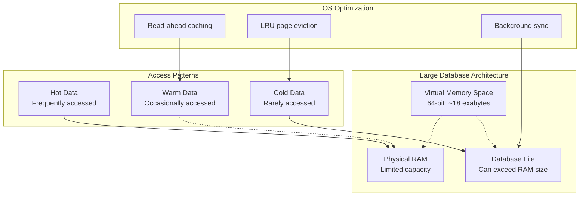

### Memory Usage Monitoring

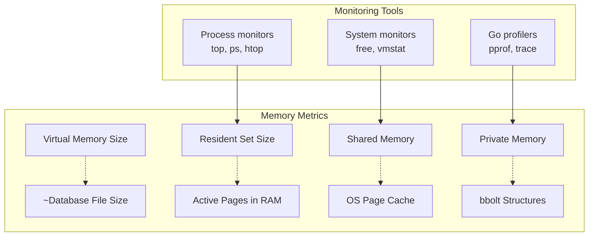

## Platform-Specific Considerations

### Memory Mapping Implementation

```mermaid
graph TD
    subgraph "Platform Differences"
        Unix[Unix/Linux<br/>mmap(), madvise()]
        Windows[Windows<br/>CreateFileMapping(), MapViewOfFile()]
        
        Unix --> UnixFlags[MAP_SHARED, MAP_PRIVATE]
        Windows --> WindowsFlags[PAGE_READONLY, FILE_MAP_READ]
    end
    
    subgraph "Platform Optimizations"
        UnixOpt[Unix Optimizations<br/>• MADV_RANDOM<br/>• MADV_SEQUENTIAL<br/>• MADV_WILLNEED]
        WindowsOpt[Windows Optimizations<br/>• File caching hints<br/>• Memory mapping flags<br/>• NUMA awareness]
        
        Unix --> UnixOpt
        Windows --> WindowsOpt
    end
```

### 32-bit vs 64-bit Considerations

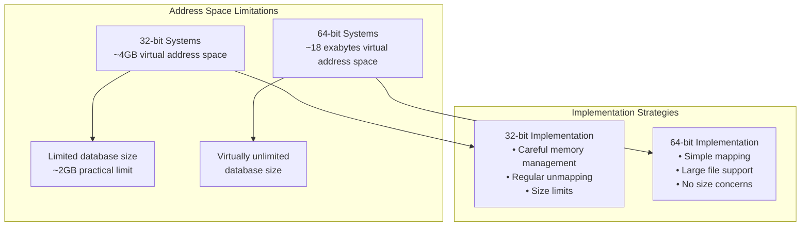

## Performance Best Practices

### Memory Usage Optimization

1. **Use Read-Only Transactions When Possible**
   ```go
   // Read-only transactions don't create dirty node copies
   db.View(func(tx *bolt.Tx) error {
       // No memory allocation for modifications
       return nil
   })
   ```

2. **Keep Transactions Short**
   ```go
   // Long transactions hold memory longer
   // Prefer short, focused transactions
   ```

3. **Configure OS for Database Workloads**
   ```bash
   # Linux: Tune VM settings for database
   echo 'vm.swappiness=1' >> /etc/sysctl.conf
   echo 'vm.dirty_ratio=15' >> /etc/sysctl.conf
   ```

4. **Monitor Memory Usage**
   ```go
   // Check database statistics
   stats := db.Stats()
   fmt.Printf("Open transactions: %d\n", stats.OpenTxN)
   fmt.Printf("Pending pages: %d\n", stats.PendingPageN)
   ```

### Memory Efficiency Patterns

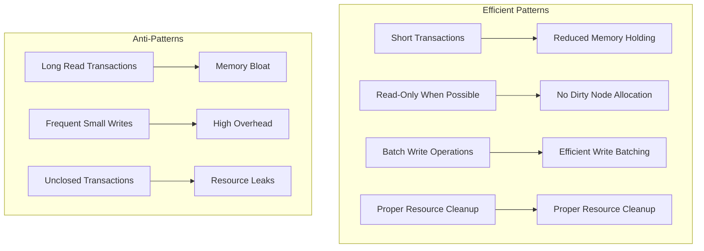

This memory management system provides efficient access to database content while minimizing memory usage through intelligent caching, memory mapping, and OS integration. The architecture scales from small embedded applications to large server deployments handling multi-gigabyte databases.