# bbolt Storage Engine

bbolt uses a B+tree storage engine with copy-on-write semantics to provide efficient key/value storage. This document details the internal storage structure, page management, and disk layout.

## B+Tree Structure

bbolt implements a B+tree where all values are stored in leaf nodes, and internal nodes contain only keys and pointers for navigation.

### B+Tree Overview

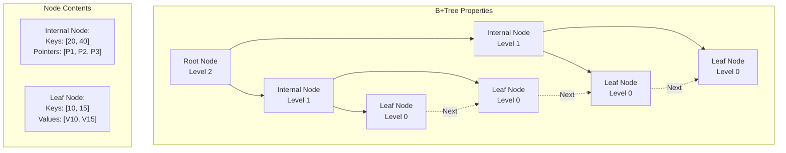

### Tree Operations

```mermaid
flowchart TD
    subgraph "Insert Operation"
        Insert[Insert Key/Value]
        FindLeaf[Find Target Leaf]
        CheckSpace[Check Available Space]
        
        Insert --> FindLeaf
        FindLeaf --> CheckSpace
        
        CheckSpace -->|Space Available| DirectInsert[Insert Directly]
        CheckSpace -->|No Space| SplitNode[Split Node]
        
        SplitNode --> PropagateUp[Propagate Split Up]
        PropagateUp --> UpdateParent[Update Parent Node]
        UpdateParent -->|Parent Full| SplitParent[Split Parent]
        SplitParent --> PropagateUp
    end
    
    subgraph "Delete Operation"
        Delete[Delete Key]
        FindKey[Locate Key in Leaf]
        RemoveKey[Remove Key/Value]
        CheckFill[Check Fill Percentage]
        
        Delete --> FindKey
        FindKey --> RemoveKey
        RemoveKey --> CheckFill
        
        CheckFill -->|Adequate Fill| Done[Complete]
        CheckFill -->|Under-filled| Rebalance[Rebalance with Sibling]
        Rebalance -->|Can Rebalance| RedistributeKeys[Redistribute Keys]
        Rebalance -->|Cannot Rebalance| MergeNodes[Merge with Sibling]
        MergeNodes --> PropagateDelete[Propagate Merge Up]
    end
```

## Page Structure

bbolt organizes data into fixed-size pages (typically 4KB) that map directly to operating system pages for efficient memory mapping.

### Page Types

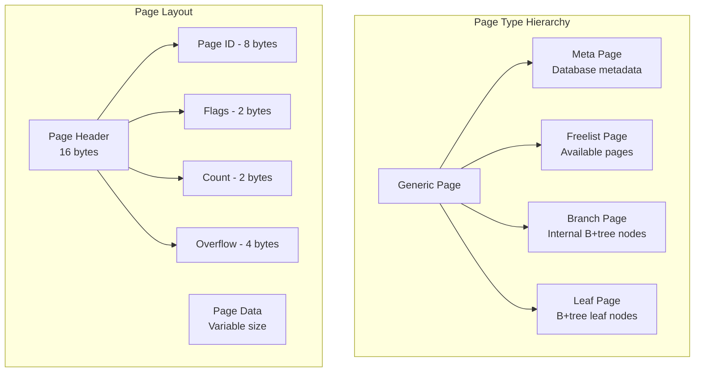

### Page Header Structure

```go
type page struct {
    id       pgid     // Page ID (8 bytes)
    flags    uint16   // Page type flags (2 bytes)
    count    uint16   // Number of elements (2 bytes)
    overflow uint32   // Number of overflow pages (4 bytes)
    ptr      uintptr  // Pointer to page data
}
```

### Page Flags

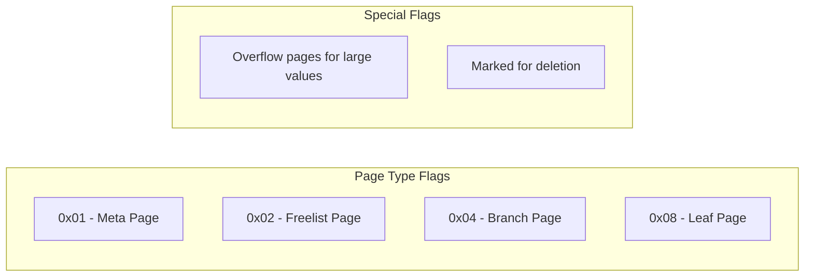

## Disk Layout

The database file has a specific layout that enables efficient access and crash recovery.

### File Layout

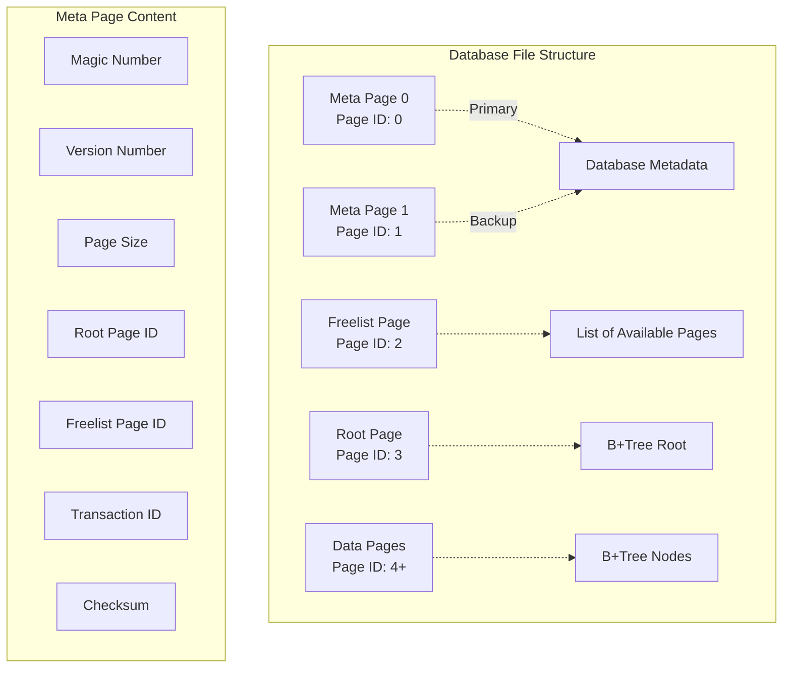

### Meta Page Structure

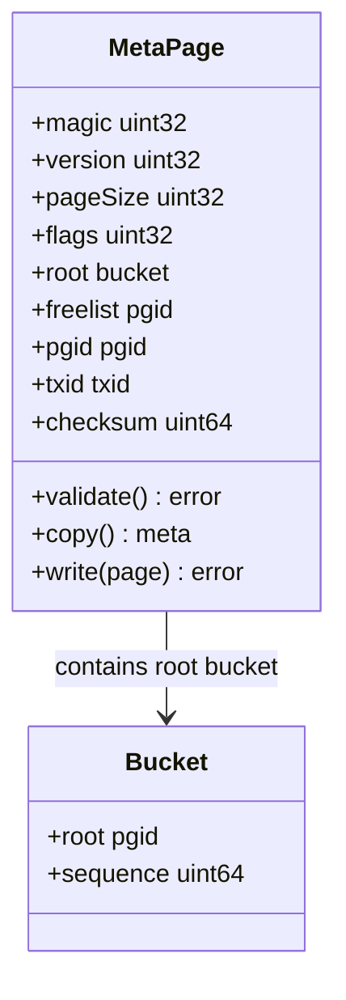

## Storage Operations

### Key Lookup Process

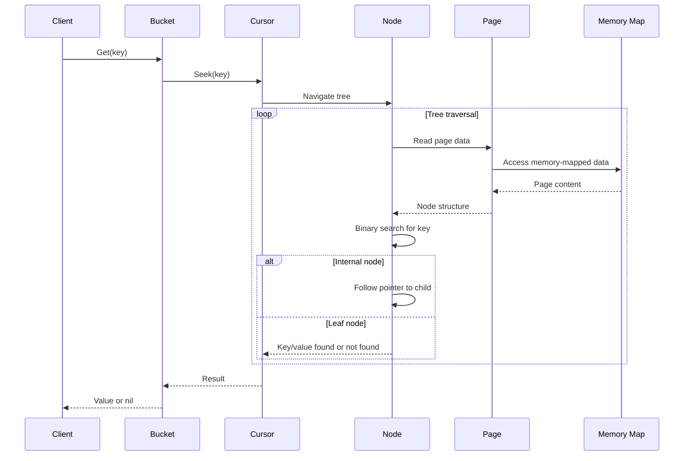

### Page Allocation and Deallocation

```mermaid
graph TD
    subgraph "Page Allocation"
        AllocRequest[Allocation Request]
        CheckFreelist[Check Freelist]
        
        AllocRequest --> CheckFreelist
        CheckFreelist -->|Pages Available| ReusePage[Reuse Free Page]
        CheckFreelist -->|No Free Pages| ExtendFile[Extend Database File]
        
        ReusePage --> UpdateFreelist[Update Freelist]
        ExtendFile --> NewPage[Create New Page]
        
        UpdateFreelist --> AllocatedPage[Allocated Page]
        NewPage --> AllocatedPage
    end
    
    subgraph "Page Deallocation"
        DeletePage[Page to Delete]
        AddToFreelist[Add to Freelist]
        CoalesceCheck[Check for Coalescing]
        
        DeletePage --> AddToFreelist
        AddToFreelist --> CoalesceCheck
        CoalesceCheck -->|Adjacent Pages Free| CoalescePages[Coalesce Pages]
        CoalesceCheck -->|No Adjacent Pages| DeallocComplete[Deallocation Complete]
        CoalescePages --> DeallocComplete
    end
```

### Copy-on-Write Implementation

bbolt uses copy-on-write to maintain consistency during modifications:

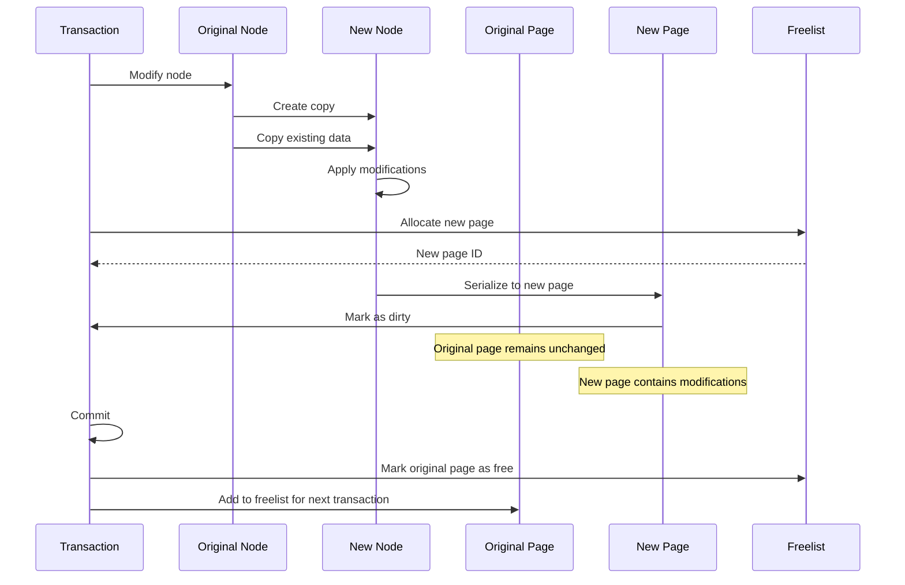

## Space Management

### Freelist Management

```mermaid
graph TD
    subgraph "Freelist Structure"
        FreelistPage[Freelist Page]
        FreelistType{Freelist Type}
        
        FreelistType -->|Array| ArrayFreelist[Array-based Freelist]
        FreelistType -->|Hashmap| HashmapFreelist[Hashmap-based Freelist]
    end
    
    subgraph "Array Freelist"
        FreeArray[Free Page Array]
        PendingArray[Pending Free Array]
        
        FreeArray -.-> ImmediateReuse[Immediate Reuse]
        PendingArray -.-> DelayedReuse[Delayed Reuse]
    end
    
    subgraph "Hashmap Freelist"
        FreeMap[Free Page Hashmap]
        PendingMap[Pending Free Hashmap]
        
        FreeMap -.-> FastLookup[O(1) Lookup]
        PendingMap -.-> FastPending[O(1) Pending Operations]
    end
```

### Page Splitting and Merging

When a page becomes too full or too empty, bbolt performs splitting or merging operations:

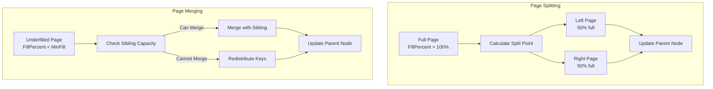

## Performance Optimizations

### Fill Percentage Configuration

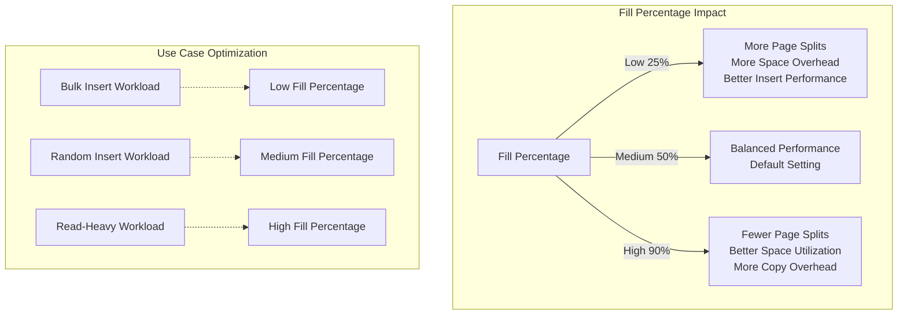

### Memory Mapping Benefits

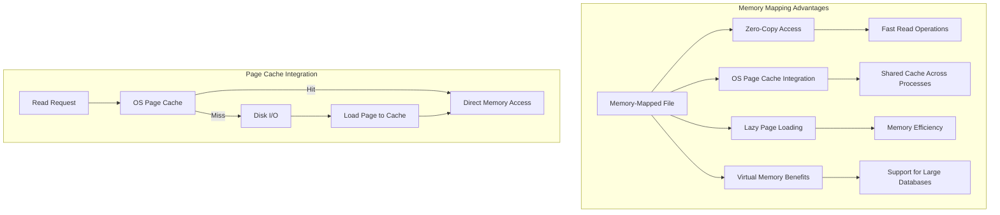

## Crash Recovery

bbolt ensures crash consistency through careful ordering of writes and dual metadata pages:

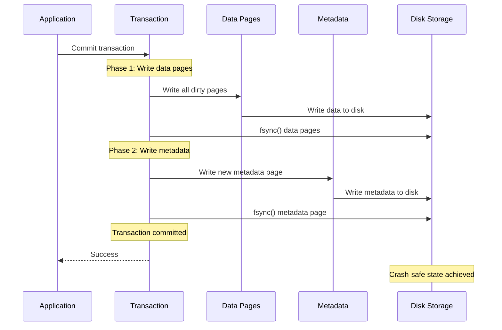

### Recovery Process

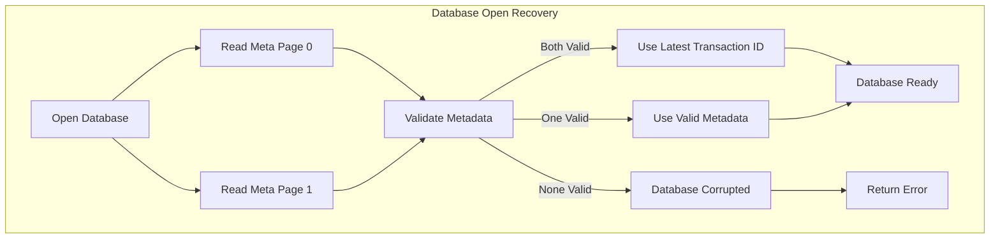

This storage engine design provides efficient access patterns, crash safety, and good performance characteristics for both read and write operations while maintaining data integrity through its B+tree structure and MVCC implementation.