# bbolt Transaction Management

bbolt implements ACID transactions with Multi-Version Concurrency Control (MVCC) to provide consistent, isolated access to the database. This document details the transaction lifecycle, concurrency model, and isolation guarantees.

## Transaction Overview

bbolt supports two types of transactions:
- **Read-only transactions**: Multiple concurrent readers with snapshot isolation
- **Read-write transactions**: Single writer with exclusive access

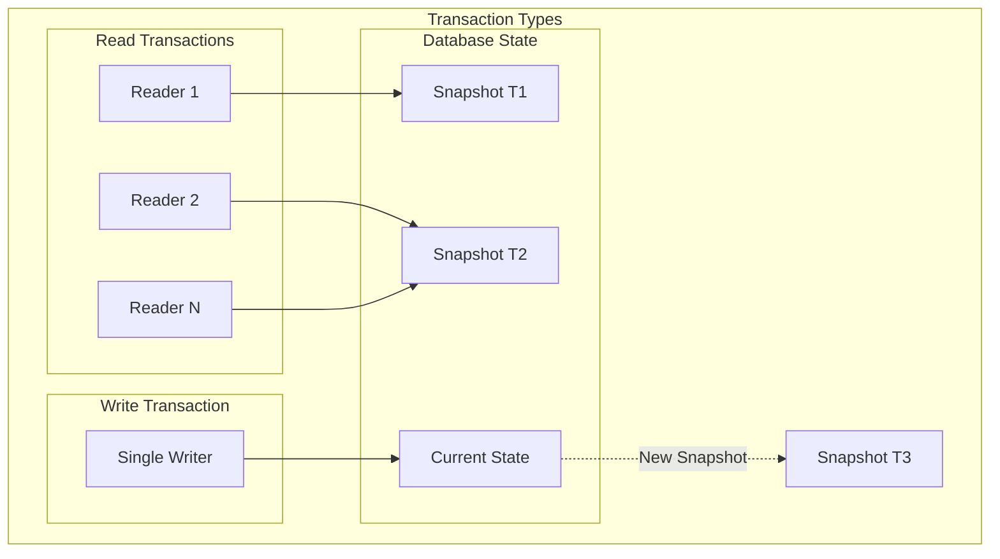

## MVCC (Multi-Version Concurrency Control)

bbolt's MVCC implementation allows multiple readers to access consistent snapshots while a single writer can modify the database without blocking readers.

### MVCC Architecture

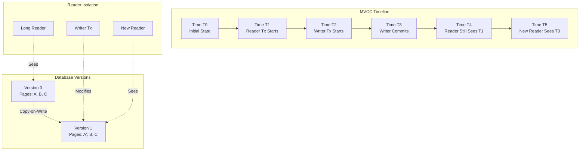

### Copy-on-Write Mechanism

When a write transaction modifies a page, bbolt creates a new copy rather than modifying the original:

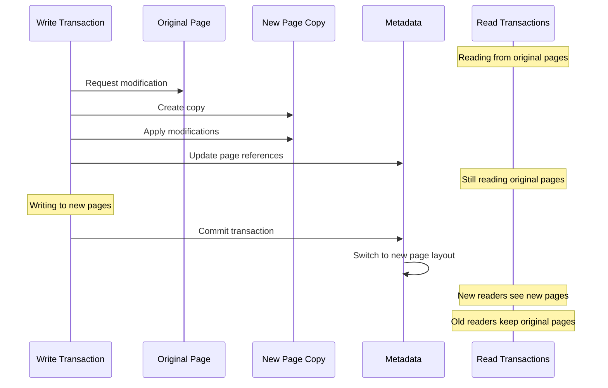

## Transaction Lifecycle

### Read-Only Transaction Lifecycle

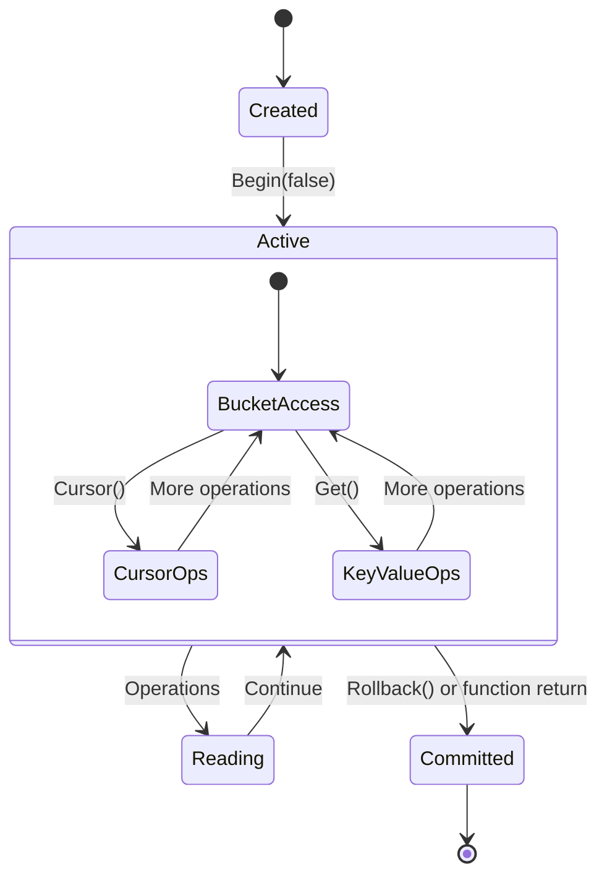

### Read-Write Transaction Lifecycle

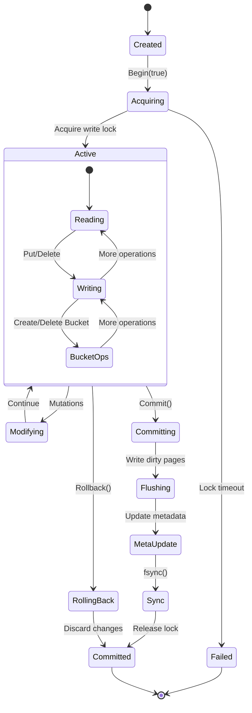

## Concurrency Control

### Lock Management

bbolt uses a combination of locks to manage concurrency:

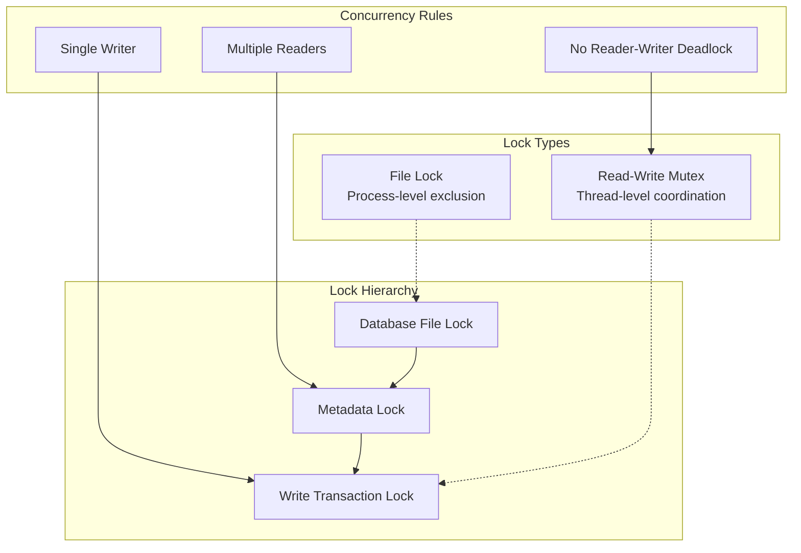

### Transaction Coordination

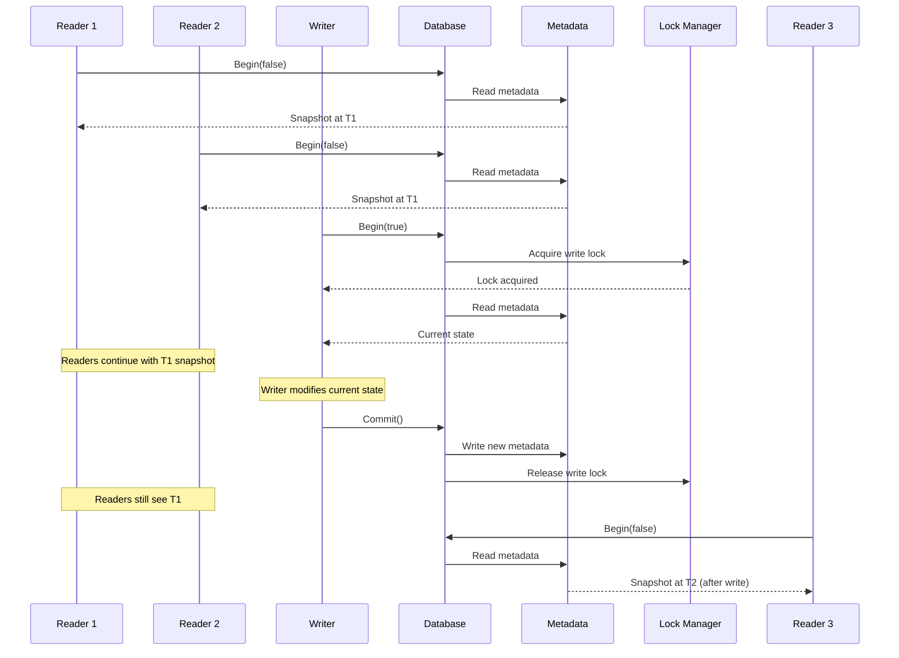

## Isolation Levels

bbolt provides **Serializable** isolation, the strongest isolation level, through its MVCC implementation.

### Isolation Guarantees

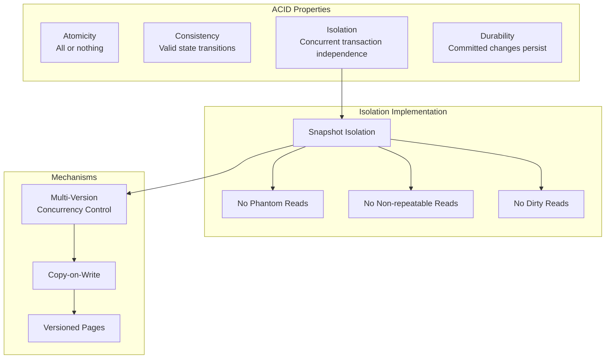

### Read Phenomena Prevention

| Phenomenon | bbolt Prevention |
|------------|------------------|
| **Dirty Read** | ✅ Prevented - Readers see only committed data |
| **Non-repeatable Read** | ✅ Prevented - Snapshot isolation maintains consistency |
| **Phantom Read** | ✅ Prevented - Consistent view throughout transaction |
| **Lost Update** | ✅ Prevented - Single writer prevents write conflicts |

## Transaction Implementation Details

### Transaction State Management

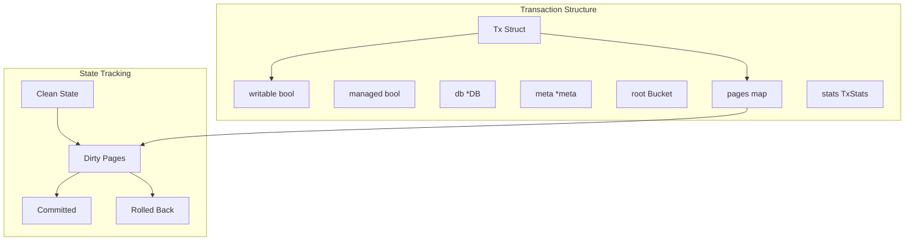

### Page Management During Transactions

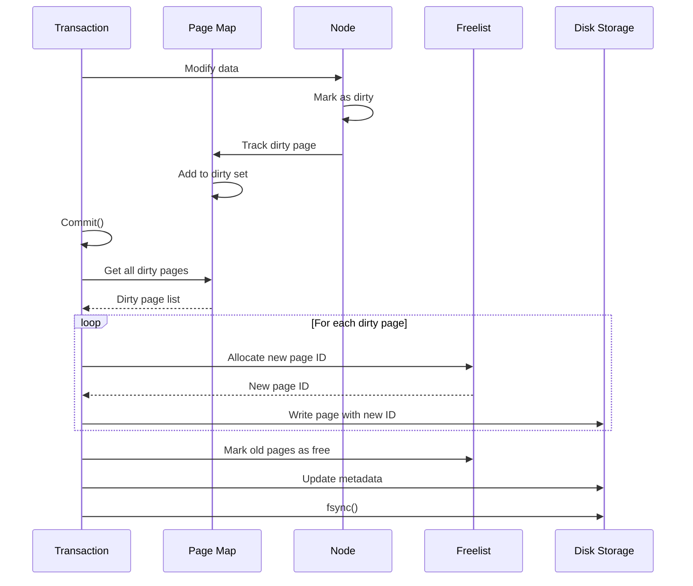

### Metadata Management

bbolt maintains two copies of metadata for crash consistency:

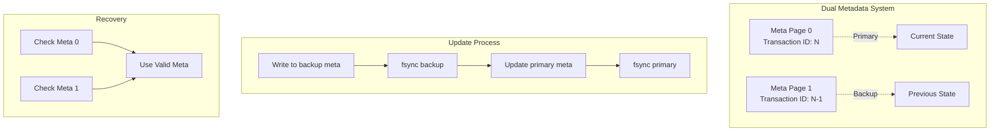

## Performance Considerations

### Transaction Performance Characteristics

```mermaid
graph TD
    subgraph "Read Performance"
        MultiReader[Multiple Readers]
        NoLocking[No Lock Contention]
        MemoryMap[Memory-Mapped Access]
        
        MultiReader --> NoLocking
        NoLocking --> MemoryMap
    end
    
    subgraph "Write Performance"
        SingleWriter[Single Writer]
        BatchWrites[Batch Operations]
        COWOverhead[Copy-on-Write Cost]
        
        SingleWriter --> BatchWrites
        BatchWrites --> COWOverhead
    end
    
    subgraph "Optimization Strategies"
        BatchAPI[DB.Batch() API]
        NoSyncMode[NoSync Mode]
        ReadOnlyTx[Read-Only When Possible]
        
        BatchAPI --> BatchWrites
        NoSyncMode --> WritePerf[Improved Write Performance]
        ReadOnlyTx --> MultiReader
    end
```

### Best Practices

1. **Use Read-Only Transactions When Possible**
   ```go
   // Prefer View() for read operations
   db.View(func(tx *bolt.Tx) error {
       // Read operations only
       return nil
   })
   ```

2. **Batch Write Operations**
   ```go
   // Use Batch() for bulk writes
   db.Batch(func(tx *bolt.Tx) error {
       // Multiple writes batched together
       return nil
   })
   ```

3. **Keep Transactions Short**
   ```go
   // Avoid long-running read transactions
   // They prevent page reclamation
   ```

4. **Handle Transaction Errors**
   ```go
   tx, err := db.Begin(true)
   if err != nil {
       return err
   }
   defer tx.Rollback() // Always rollback on error
   
   // ... operations ...
   
   return tx.Commit() // Explicit commit
   ```

This transaction management system provides strong consistency guarantees while allowing high concurrency for read operations, making bbolt suitable for applications that need reliable data storage with good read performance.